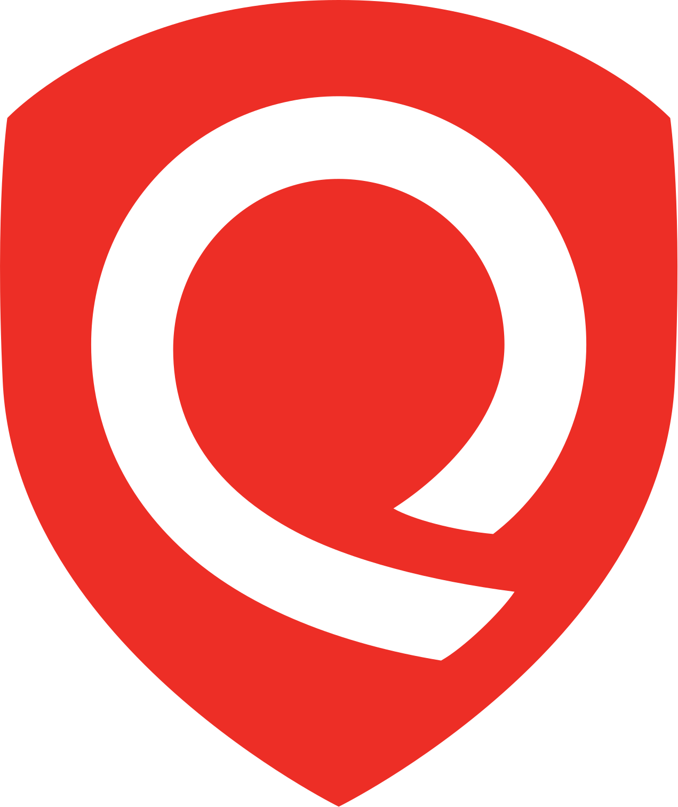

# Gabriel Wolf

Security Engineer focused on **security automation, AI security, and vulnerability management**.

I build autonomous security workflows, enterprise remediation tooling, and secure AI integrations.

## Featured Projects

- **[SOAR Playbook Library](https://github.com/gabriel-wolf/soar-playbook-library)** — Sanitized Azure Logic Apps and Microsoft Sentinel playbooks for automated incident response, host isolation, and alert triage.
- **[AD-to-Qualys Automation](https://github.com/gabriel-wolf/ad-to-qualys)** — PowerShell automation that synchronizes Active Directory groups with Qualys Patch Management targeting.

## Technologies

 
  

  

  

  

  

## Connect

